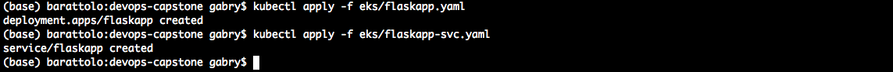
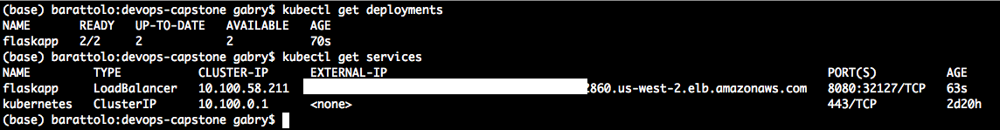
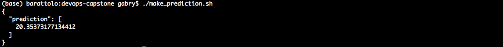
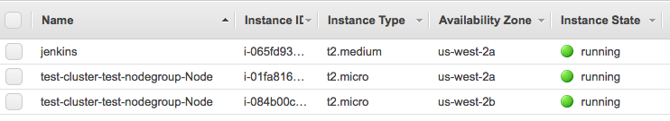
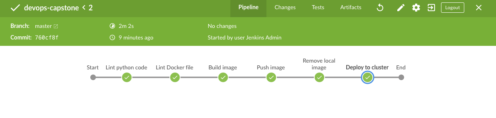
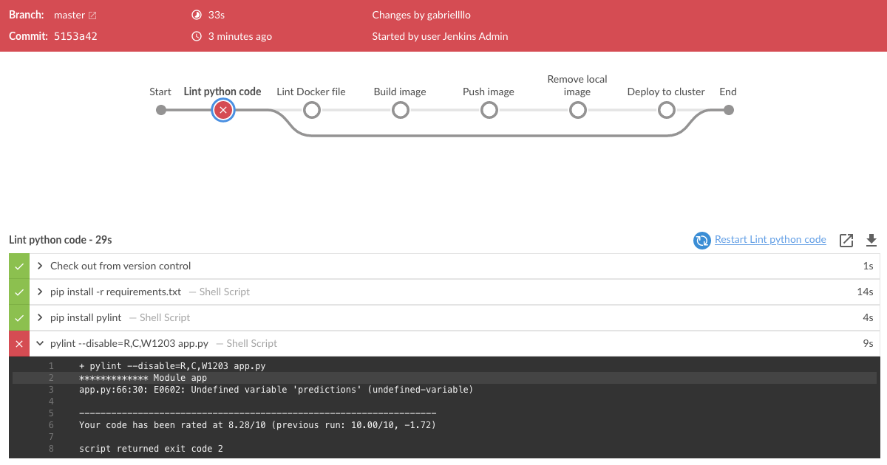
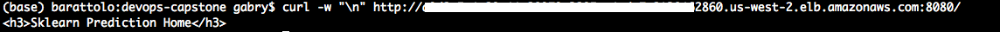

# Deploy a Machine Learning model on Kubernetes using Jenkins

## Overview

This repository shows how to operationalize a Machine Learning Microservice API on a Kubernetes cluster using Jenkins.

The application contains a pre-trained `sklearn` model that predicts housing prices in Boston according to several features. More info about the data, which was initially downloaded from Kaggle, can be found on [the data source site](https://www.kaggle.com/c/boston-housing). 

The predictions of the model are served through a Python flask app implemented in the file `app.py`, that responds to API calls. This example application could be extended to any pre-trained machine learning model, such as those for image recognition and data labeling.

The application is containerized using Docker and deployed to a Kubernetes cluster on the AWS cloud, while a CI/CD pipeline in Jenkins is used to continously integrate, test and deploy updates of the application using a `rolling deployment` approach.

## Prerequisites
In order to setup the required infrastructure, you will need:
- an AWS account
- an installed and configured AWS CLI
- the additional commands `eksctl` and `kubectl`, [see this AWS documentation on how to set them up](https://docs.aws.amazon.com/eks/latest/userguide/getting-started-eksctl.html).

## Kubernetes cluster setup
-  You can setup a kubernetes cluster with 2 `t2.micro` nodes using EKS on AWS with the following command:  
`eksctl create cluster -f eks/eks_config.yaml`  
The cluster can be deleted using:  
`eksctl delete cluster --region=us-west-2 --name=test-cluster`

-  After the cluster is setup, you'll be able to check its status using the `kubectl` command:  
`kubectl get nodes`  

-  Deploy the initial version of the application on 2 pods and expose it as a service:  
`kubectl apply -f eks/flaskapp.yaml`  
`kubectl apply -f eks/flaskapp-svc.yaml`

- You can now check that the application is running using:  
`kubectl get deployments`  
`kubectl get services`  

- you can then test that the application is running by using the provided script, using the correct address for the load balancer (check the EXTERNAL-IP column in the output of the `get services` command):  
`./make_prediction.sh`

Now you have a working Kubernetes cluster with 2 nodes on AWS with an application deployed that runs on one pod.

## Jenkins setup
Install Jenkins on a EC2 instance to manage the pipeline.
- follow [these instructions](https://www.jenkins.io/doc/book/installing/) to install Jenkins
- install Jenkins plugins, at least: blue ocean, docker, github, AWS credentials, Pyenv Pipeline. A full list of the plugins used for this project is available in `eks/jenkins_plugins.txt`
- install `python3` on the Jenkins node
- install `kubectl` on the Jenins node
- install `hadolint` on the Jenkins node
- install the AWS CLI on the Jenkins node, configure it for the user `jenkins` on the machine
- You will need to authorize the AWS user credentials stored for the `jenkins` user to access your cluster, you can follow the example file provided and modify it for your needs:   
`kubectl apply -f eks/aws-auth.yaml`  
A full explanation on how to do it is available at this [tutorial page from AWS](https://aws.amazon.com/it/premiumsupport/knowledge-center/amazon-eks-cluster-access/).

## Instances on EC2:
At the end of the process you'll have something similar to this in your EC2 page:

## Jenkins pipeline
The implemented Jenkins pipeline will:
- checkout code from github
- lint the python code using `pylint` in a `python3` environment
- lint the docker file using `hadolint`
- build the docker image and push it to dockerhub
- deploy the new image on the kubernetes cluster and update the running application to its latest version: first new pods will be created to run the latest version of the application, then the pods running the old version will be deleted.

If the pipeline runs successfully, you should see something like this in Blue Ocean:

## Example workflow

Here we can see what happens when a new version of the application is committed to git that contains errors or does not pass the linting step.  
For example, let's add a typo in L66 of `app.py`: the pipeline will fail and avoid deploying the application to production, you will see something like this in Blue Ocean:  

Notice that our application also serves a standard endpoint that returns `<h3>Sklearn Prediction Home</h3>`, see `app.py` in L23:  

We will now correct the error in `app.py` and then deploy a new version of the application that serves a `<h3>Sklearn Prediction Home version 2</h3>` message, modifying L23 and L66 in `app.py`.

