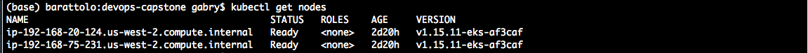

# Deploy a Machine Learning model on Kubernetes using Jenkins

## Overview

This repository shows how to operationalize a Machine Learning Microservice API on a Kubernetes cluster using Jenkins.

The application contains a pre-trained `sklearn` model that predicts housing prices in Boston according to several features. More info about the data, which was initially downloaded from Kaggle, can be found on [the data source site](https://www.kaggle.com/c/boston-housing). 

The predictions of the model are served through a Python flask app implemented in the file `app.py`, that responds to API calls. This example application could be extended to any pre-trained machine learning model, such as those for image recognition and data labeling.

The application is containerized using Docker and deployed to a Kubernetes cluster on the AWS cloud, while a CI/CD pipeline in Jenkins is used to continously integrate, test and deploy updates of the application using a `rolling deployment` approach.

## Prerequisites
In order to setup the required infrastructure, you will need:
- an AWS account
- an installed and configured AWS CLI
- the additional commands `eksctl` and `kubectl`, [see this AWS documentation on how to set them up](https://docs.aws.amazon.com/eks/latest/userguide/getting-started-eksctl.html).

## Kubernetes cluster setup
-  You can setup a cluster using EKS on AWS with the following command:  
`eksctl create cluster -f eks/eks_config.yaml`  
The cluster can be deleted using:  
`eksctl delete cluster --region=us-west-2 --name=test-cluster`

-  After the cluster is setup, you'll be able to check its status using the `kubectl` command:  
`kubectl get nodes`  

-  You will need to authorize the user under which jenkins is running to access your cluster, you can follow the example file provided and modify accordingly:   
`kubectl apply -f eks/aws-auth.yaml`  
A full explanation on how to do it is available at this [tutorial page from AWS](https://aws.amazon.com/it/premiumsupport/knowledge-center/amazon-eks-cluster-access/).

-  Deploy the initial version of the application on 2 pods and expose it as a service:  
`kubectl apply -f eks/flaskapp.yaml`  
`kubectl apply -f eks/flaskapp-svc.yaml`

- you can now check that the application is running using:  
`kubectl get deployments`  
`kubectl get services`  

- you can then test that the application is running by using the provided script, using the correct address for the load balancer (check the EXTERNAL-IP column in the output of the `get services` command):  
`./make_prediction.sh`

## Jenkins setup
Install Jenkins on a EC2 instance to manage the pipeline.

## Pipeline